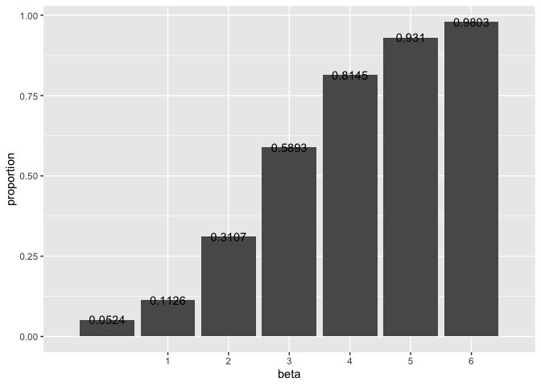
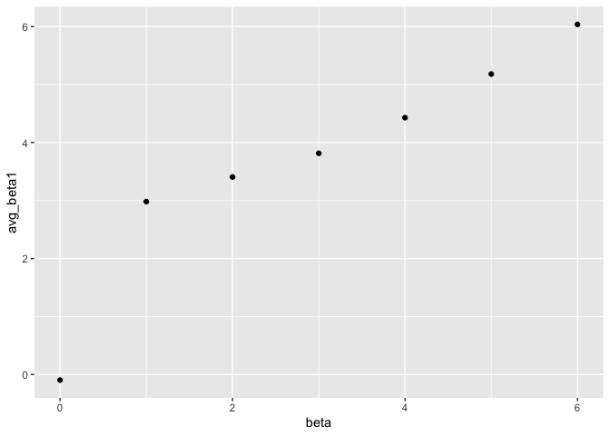
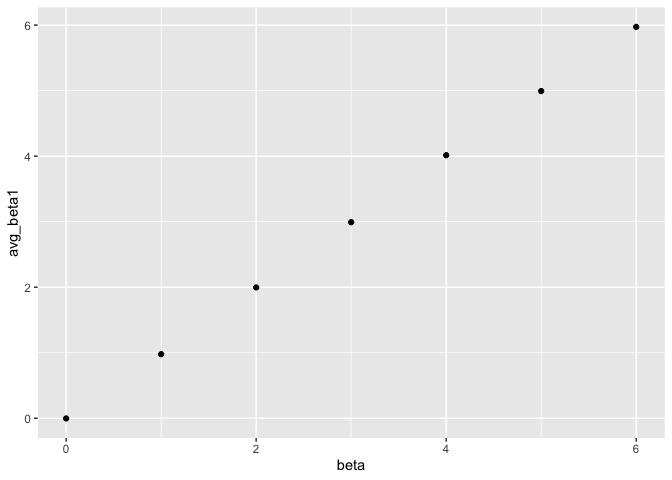

p8105\_hw5\_cx2227
================
Chuyue Xiang
11/7/2019

## Problem 1

``` r
library(tidyverse)
```

    ## ── Attaching packages ───────────────────────────────────────────────────────────────── tidyverse 1.2.1 ──

    ## ✔ ggplot2 3.2.1     ✔ purrr   0.3.2
    ## ✔ tibble  2.1.3     ✔ dplyr   0.8.3
    ## ✔ tidyr   1.0.0     ✔ stringr 1.4.0
    ## ✔ readr   1.3.1     ✔ forcats 0.4.0

    ## ── Conflicts ──────────────────────────────────────────────────────────────────── tidyverse_conflicts() ──
    ## ✖ dplyr::filter()         masks stats::filter()
    ## ✖ readr::guess_encoding() masks rvest::guess_encoding()
    ## ✖ dplyr::lag()            masks stats::lag()
    ## ✖ purrr::pluck()          masks rvest::pluck()

``` r
set.seed(10)

iris_with_missing = iris %>% 
  map_df(~replace(.x, sample(1:150, 20), NA)) %>%
  mutate(Species = as.character(Species))
```

``` r
replace_missing_values = function(vec) {
  if(is.numeric(vec))
  {vec = replace(vec, is.na(vec), round(mean(vec, na.rm = TRUE), digits = 1))}
  else if (is.character(vec)) {
    vec = replace(vec, is.na(vec), "virginica")}
  }
```

``` r
iris_with_missing %>%
  map_df(~replace_missing_values(.x)) %>%
  knitr::kable()
```

| Sepal.Length | Sepal.Width | Petal.Length | Petal.Width | Species    |
| -----------: | ----------: | -----------: | ----------: | :--------- |
|          5.1 |         3.5 |          1.4 |         0.2 | setosa     |
|          4.9 |         3.0 |          1.4 |         0.2 | setosa     |
|          4.7 |         3.2 |          1.3 |         0.2 | setosa     |
|          4.6 |         3.1 |          1.5 |         1.2 | setosa     |
|          5.0 |         3.6 |          1.4 |         0.2 | setosa     |
|          5.4 |         3.9 |          1.7 |         0.4 | setosa     |
|          5.8 |         3.4 |          1.4 |         0.3 | setosa     |
|          5.0 |         3.4 |          1.5 |         0.2 | setosa     |
|          4.4 |         2.9 |          1.4 |         0.2 | setosa     |
|          4.9 |         3.1 |          3.8 |         0.1 | setosa     |
|          5.4 |         3.1 |          1.5 |         0.2 | setosa     |
|          4.8 |         3.4 |          1.6 |         0.2 | setosa     |
|          5.8 |         3.1 |          1.4 |         0.1 | setosa     |
|          4.3 |         3.0 |          3.8 |         0.1 | setosa     |
|          5.8 |         4.0 |          3.8 |         0.2 | setosa     |
|          5.7 |         4.4 |          1.5 |         0.4 | setosa     |
|          5.4 |         3.9 |          1.3 |         0.4 | setosa     |
|          5.1 |         3.5 |          1.4 |         1.2 | setosa     |
|          5.7 |         3.8 |          1.7 |         0.3 | setosa     |
|          5.1 |         3.8 |          1.5 |         1.2 | setosa     |
|          5.4 |         3.4 |          1.7 |         0.2 | setosa     |
|          5.1 |         3.7 |          1.5 |         0.4 | virginica  |
|          4.6 |         3.6 |          1.0 |         0.2 | setosa     |
|          5.8 |         3.3 |          3.8 |         0.5 | setosa     |
|          4.8 |         3.4 |          1.9 |         0.2 | virginica  |
|          5.0 |         3.0 |          3.8 |         0.2 | setosa     |
|          5.0 |         3.4 |          1.6 |         0.4 | virginica  |
|          5.2 |         3.5 |          1.5 |         0.2 | setosa     |
|          5.8 |         3.4 |          1.4 |         0.2 | setosa     |
|          4.7 |         3.2 |          1.6 |         0.2 | setosa     |
|          4.8 |         3.1 |          3.8 |         0.2 | setosa     |
|          5.4 |         3.1 |          1.5 |         0.4 | setosa     |
|          5.2 |         3.1 |          1.5 |         0.1 | setosa     |
|          5.5 |         4.2 |          1.4 |         0.2 | setosa     |
|          4.9 |         3.1 |          3.8 |         0.2 | setosa     |
|          5.0 |         3.2 |          1.2 |         0.2 | setosa     |
|          5.5 |         3.5 |          1.3 |         0.2 | setosa     |
|          4.9 |         3.6 |          1.4 |         0.1 | setosa     |
|          4.4 |         3.0 |          1.3 |         1.2 | setosa     |
|          5.1 |         3.4 |          1.5 |         0.2 | setosa     |
|          5.0 |         3.5 |          1.3 |         0.3 | setosa     |
|          4.5 |         3.1 |          1.3 |         1.2 | virginica  |
|          4.4 |         3.2 |          1.3 |         0.2 | setosa     |
|          5.0 |         3.5 |          1.6 |         0.6 | setosa     |
|          5.1 |         3.8 |          1.9 |         0.4 | setosa     |
|          4.8 |         3.0 |          1.4 |         0.3 | virginica  |
|          5.1 |         3.8 |          1.6 |         0.2 | setosa     |
|          4.6 |         3.2 |          3.8 |         0.2 | setosa     |
|          5.3 |         3.7 |          1.5 |         0.2 | setosa     |
|          5.0 |         3.1 |          1.4 |         0.2 | setosa     |
|          7.0 |         3.1 |          4.7 |         1.4 | virginica  |
|          6.4 |         3.2 |          4.5 |         1.5 | versicolor |
|          6.9 |         3.1 |          4.9 |         1.5 | versicolor |
|          5.5 |         2.3 |          4.0 |         1.3 | versicolor |
|          6.5 |         2.8 |          4.6 |         1.5 | versicolor |
|          5.7 |         2.8 |          4.5 |         1.3 | versicolor |
|          6.3 |         3.3 |          4.7 |         1.6 | virginica  |
|          4.9 |         2.4 |          3.8 |         1.0 | versicolor |
|          6.6 |         2.9 |          4.6 |         1.3 | virginica  |
|          5.2 |         2.7 |          3.9 |         1.4 | versicolor |
|          5.0 |         2.0 |          3.8 |         1.0 | versicolor |
|          5.9 |         3.0 |          4.2 |         1.5 | versicolor |
|          6.0 |         2.2 |          4.0 |         1.2 | versicolor |
|          6.1 |         2.9 |          4.7 |         1.4 | versicolor |
|          5.6 |         2.9 |          3.6 |         1.3 | versicolor |
|          6.7 |         3.1 |          4.4 |         1.4 | versicolor |
|          5.6 |         3.0 |          4.5 |         1.5 | versicolor |
|          5.8 |         3.1 |          4.1 |         1.0 | versicolor |
|          6.2 |         2.2 |          4.5 |         1.5 | versicolor |
|          5.6 |         2.5 |          3.9 |         1.1 | versicolor |
|          5.9 |         3.2 |          4.8 |         1.8 | versicolor |
|          5.8 |         2.8 |          4.0 |         1.3 | virginica  |
|          6.3 |         2.5 |          4.9 |         1.5 | versicolor |
|          5.8 |         2.8 |          3.8 |         1.2 | versicolor |
|          6.4 |         2.9 |          4.3 |         1.3 | versicolor |
|          6.6 |         3.0 |          4.4 |         1.4 | versicolor |
|          6.8 |         2.8 |          4.8 |         1.4 | versicolor |
|          6.7 |         3.1 |          5.0 |         1.2 | versicolor |
|          6.0 |         3.1 |          4.5 |         1.2 | versicolor |
|          5.7 |         2.6 |          3.5 |         1.0 | virginica  |
|          5.5 |         2.4 |          3.8 |         1.1 | versicolor |
|          5.8 |         2.4 |          3.7 |         1.0 | versicolor |
|          5.8 |         2.7 |          3.9 |         1.2 | versicolor |
|          6.0 |         2.7 |          5.1 |         1.6 | versicolor |
|          5.4 |         3.0 |          4.5 |         1.5 | versicolor |
|          5.8 |         3.4 |          4.5 |         1.6 | versicolor |
|          6.7 |         3.1 |          4.7 |         1.2 | versicolor |
|          5.8 |         3.1 |          4.4 |         1.3 | versicolor |
|          5.6 |         3.0 |          3.8 |         1.2 | versicolor |
|          5.5 |         2.5 |          4.0 |         1.2 | versicolor |
|          5.5 |         3.1 |          4.4 |         1.2 | versicolor |
|          5.8 |         3.1 |          4.6 |         1.2 | versicolor |
|          5.8 |         3.1 |          4.0 |         1.2 | versicolor |
|          5.0 |         2.3 |          3.3 |         1.2 | virginica  |
|          5.8 |         2.7 |          4.2 |         1.3 | versicolor |
|          5.7 |         3.0 |          4.2 |         1.2 | versicolor |
|          5.7 |         2.9 |          4.2 |         1.3 | versicolor |
|          6.2 |         2.9 |          4.3 |         1.3 | versicolor |
|          5.1 |         2.5 |          3.0 |         1.2 | versicolor |
|          5.7 |         2.8 |          4.1 |         1.3 | virginica  |
|          6.3 |         3.1 |          3.8 |         2.5 | virginica  |
|          5.8 |         2.7 |          5.1 |         1.9 | virginica  |
|          7.1 |         3.0 |          5.9 |         2.1 | virginica  |
|          6.3 |         2.9 |          5.6 |         1.8 | virginica  |
|          6.5 |         3.1 |          5.8 |         2.2 | virginica  |
|          7.6 |         3.0 |          6.6 |         2.1 | virginica  |
|          4.9 |         2.5 |          4.5 |         1.7 | virginica  |
|          7.3 |         2.9 |          6.3 |         1.8 | virginica  |
|          6.7 |         3.1 |          3.8 |         1.8 | virginica  |
|          5.8 |         3.6 |          3.8 |         2.5 | virginica  |
|          6.5 |         3.2 |          5.1 |         2.0 | virginica  |
|          5.8 |         2.7 |          5.3 |         1.9 | virginica  |
|          6.8 |         3.0 |          5.5 |         2.1 | virginica  |
|          5.7 |         3.1 |          5.0 |         2.0 | virginica  |
|          5.8 |         2.8 |          5.1 |         2.4 | virginica  |
|          6.4 |         3.2 |          5.3 |         2.3 | virginica  |
|          6.5 |         3.0 |          3.8 |         1.8 | virginica  |
|          7.7 |         3.8 |          6.7 |         1.2 | virginica  |
|          7.7 |         2.6 |          6.9 |         2.3 | virginica  |
|          6.0 |         2.2 |          5.0 |         1.5 | virginica  |
|          5.8 |         3.2 |          5.7 |         1.2 | virginica  |
|          5.6 |         3.1 |          4.9 |         2.0 | virginica  |
|          7.7 |         2.8 |          6.7 |         2.0 | virginica  |
|          6.3 |         2.7 |          4.9 |         1.8 | virginica  |
|          6.7 |         3.3 |          5.7 |         2.1 | virginica  |
|          7.2 |         3.2 |          6.0 |         1.8 | virginica  |
|          6.2 |         2.8 |          4.8 |         1.8 | virginica  |
|          6.1 |         3.0 |          4.9 |         1.8 | virginica  |
|          6.4 |         2.8 |          5.6 |         2.1 | virginica  |
|          7.2 |         3.0 |          5.8 |         1.6 | virginica  |
|          7.4 |         2.8 |          6.1 |         1.2 | virginica  |
|          7.9 |         3.8 |          3.8 |         2.0 | virginica  |
|          6.4 |         2.8 |          3.8 |         2.2 | virginica  |
|          5.8 |         2.8 |          5.1 |         1.5 | virginica  |
|          6.1 |         3.1 |          5.6 |         1.4 | virginica  |
|          5.8 |         3.0 |          6.1 |         2.3 | virginica  |
|          5.8 |         3.4 |          5.6 |         1.2 | virginica  |
|          6.4 |         3.1 |          5.5 |         1.2 | virginica  |
|          6.0 |         3.0 |          4.8 |         1.8 | virginica  |
|          6.9 |         3.1 |          5.4 |         2.1 | virginica  |
|          6.7 |         3.1 |          5.6 |         2.4 | virginica  |
|          6.9 |         3.1 |          5.1 |         2.3 | virginica  |
|          5.8 |         2.7 |          5.1 |         1.9 | virginica  |
|          6.8 |         3.2 |          3.8 |         2.3 | virginica  |
|          6.7 |         3.3 |          3.8 |         2.5 | virginica  |
|          6.7 |         3.0 |          5.2 |         2.3 | virginica  |
|          6.3 |         2.5 |          5.0 |         1.9 | virginica  |
|          6.5 |         3.0 |          5.2 |         2.0 | virginica  |
|          5.8 |         3.4 |          5.4 |         2.3 | virginica  |
|          5.9 |         3.0 |          5.1 |         1.8 | virginica  |

## Problem 2

``` r
tibble(list.files(path = "./data")) %>% 
  rename(arm_id = `list.files(path = "./data")`) %>% 
  mutate(list1 = "./data/", list2 = str_c(list1, arm_id) ,data = map(list2, read.csv)) %>% 
  unnest() %>% 
  
  pivot_longer(
    cols = starts_with("week"),
    names_to = "week",
    names_prefix = "week_",
    values_to = "data"
    ) %>% 
  subset.data.frame(select = c("arm_id","week","data")) %>% 
  
  ggplot(aes(x = week, y = data, group = arm_id, color = arm_id)) +
  geom_path() +
  labs(
    title = "Observations of two arms of participants over 8 weeks",
    x = "Week", 
    y = "Value"
    ) 
```

    ## Warning: `cols` is now required.
    ## Please use `cols = c(data)`

<!-- -->

  - From the plot, we can see that generally, experiment group had a
    larger value than the control group. And the experiment group
    experienced a significant growth during the 8 weeks when control
    group stayed mostly the same level as they started.

## Problem 3

``` r
sim_regression = function(n = 30, beta0 = 2, beta1 = 0) {
  
  sim_data = tibble(
    x = rnorm(n, mean = 1, sd = 1),
    y = beta0 + beta1 * x + rnorm(n, 0, sqrt(50))
  )
  
  ls_fit = lm(y ~ x, data = sim_data)
  
  tibble(
    beta1_hat = coef(ls_fit)[2],
    p_value = broom::tidy(ls_fit)[[2,5]]
  )
}

sim_regression()
```

    ## # A tibble: 1 x 2
    ##   beta1_hat p_value
    ##       <dbl>   <dbl>
    ## 1      2.02   0.207

``` r
sim_results_beta1_0 = 
  rerun(10000, sim_regression(30, 2, 0)) %>% 
  bind_rows() %>% 
  mutate(beta = 0)

sim_results_beta1_1 = 
  rerun(10000, sim_regression(30, 2, 1)) %>% 
  bind_rows() %>% 
  mutate(beta = 1)

sim_results_beta1_2 = 
  rerun(10000, sim_regression(30, 2, 2)) %>% 
  bind_rows() %>% 
  mutate(beta = 2)

sim_results_beta1_3 = 
  rerun(10000, sim_regression(30, 2, 3)) %>% 
  bind_rows() %>% 
  mutate(beta = 3)

sim_results_beta1_4 = 
  rerun(10000, sim_regression(30, 2, 4)) %>% 
  bind_rows() %>% 
  mutate(beta = 4)

sim_results_beta1_5 = 
  rerun(10000, sim_regression(30, 2, 5)) %>% 
  bind_rows() %>% 
  mutate(beta = 5)

sim_results_beta1_6 = 
  rerun(10000, sim_regression(30, 2, 6)) %>% 
  bind_rows() %>% 
  mutate(beta = 6)

bind_rows(sim_results_beta1_0, sim_results_beta1_1, sim_results_beta1_2, sim_results_beta1_3, sim_results_beta1_4, sim_results_beta1_5, sim_results_beta1_6) %>% 
  mutate(reject = case_when(p_value < 0.05 ~"1", TRUE ~"0")) %>% 
  
  group_by(beta) %>% 
  summarize(reject_sum = sum(as.numeric(reject)), n_obs = n()) %>% 
  mutate(proportion = reject_sum/n_obs) %>%
  
  ggplot(aes(x = beta, y = proportion)) +
  geom_bar(stat = "identity")+
  scale_x_discrete(limits=c("1","2","3","4","5","6"))+
  geom_text(aes(label=proportion))
```

<!-- -->

  - From the bar chart, we can see that as the effect size grows, more
    and more false null hypothesis got
rejected.

<!-- end list -->

``` r
reject_summary = bind_rows(sim_results_beta1_0, sim_results_beta1_1, sim_results_beta1_2, sim_results_beta1_3, sim_results_beta1_4, sim_results_beta1_5, sim_results_beta1_6) %>% 
  filter(p_value < 0.05) %>% 
  group_by(beta) %>% 
  summarize(avg_beta1 = mean(beta1_hat))

reject_summary %>%   
ggplot(aes(x = beta, y = avg_beta1)) + 
  geom_point(data = reject_summary)
```

<!-- -->

``` r
bind_rows(sim_results_beta1_0, sim_results_beta1_1, sim_results_beta1_2, sim_results_beta1_3, sim_results_beta1_4, sim_results_beta1_5, sim_results_beta1_6) %>% 
  group_by(beta) %>% 
  summarize(avg_beta1 = mean(beta1_hat)) %>% 
  
  ggplot(aes(x = beta, y = avg_beta1)) + 
  geom_point()
```

<!-- -->

  - Is the sample average of β̂ 1 across tests for which the null is
    rejected approximately equal to the true value of β1? Why or why
    not?
  - The sample average of β̂ 1 across tests for which the null is
    rejected is not approximately equal to the true value. Because
    larger the effective size, more false null hypothesis got rejected.
    These rejected beta have p-value less than 0.05 will not be a good
    estimator of the ture value.
